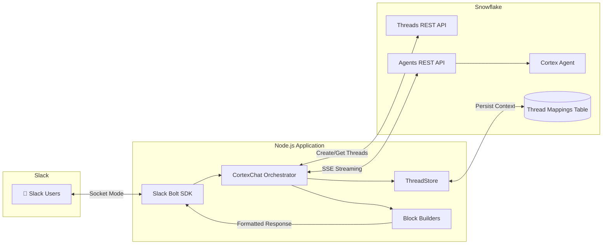
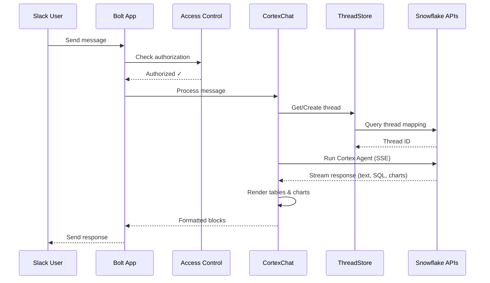

# Sales Assistant Slack Bot

A Slack bot that integrates with **Snowflake Cortex Agents** to enable natural language querying of sales data. Users can ask questions in Slack and receive responses with text, tables (rendered as images), and charts.

## Architecture



### Data Flow



### Key Components

| Component | File | Purpose |
|-----------|------|---------|
| Entry Point | `index.js` | Slack Bolt app, event handlers, access control |
| Chat Orchestrator | `src/services/cortexChat.js` | Manages threads, messages, and streaming |
| JWT Auth | `src/services/jwtGenerator.js` | RS256 keypair authentication with Snowflake |
| Snowflake APIs | `src/services/snowflake/` | REST clients (Threads, Agents, SQL) |
| Block Builders | `src/blocks/` | Format responses for Slack (charts, tables, text) |
| Utilities | `src/utils/` | Table-to-image rendering, chart utils, formatters |

## Prerequisites

### Snowflake
- Snowflake account with Cortex Agents enabled
- A configured Cortex Agent with access to your sales data
- Service account with RSA keypair authentication
- Thread mappings table for conversation persistence

### Slack
- Slack workspace with admin access
- Slack app created from the provided manifest

### Local Development
- Node.js 18, 20, or 22
- Docker (optional, for containerized deployment)

## Setup Guide

### 1. Create Snowflake Service Account

Generate RSA keypair:

```bash
# Generate private key
openssl genrsa 2048 | openssl pkcs8 -topk8 -inform PEM -out rsa_key.p8 -nocrypt

# Generate public key
openssl rsa -in rsa_key.p8 -pubout -out rsa_key.pub
```

Create service account in Snowflake:

```sql
-- Create the service account user
CREATE USER SVC_SALES_ASSISTANT
  TYPE = SERVICE
  RSA_PUBLIC_KEY = '<paste_public_key_content_without_header_footer>'
  DEFAULT_WAREHOUSE = 'COMPUTE_WH'
  DEFAULT_ROLE = 'YOUR_ROLE';

-- Grant necessary role
GRANT ROLE YOUR_ROLE TO USER SVC_SALES_ASSISTANT;
```

### 2. Create Thread Mappings Table

```sql
CREATE TABLE SLACK_THREAD_MAPPINGS (
    SLACK_THREAD_ID     VARCHAR PRIMARY KEY,
    SNOWFLAKE_THREAD_ID VARCHAR,
    LAST_MESSAGE_ID     NUMBER,
    USER_ID             VARCHAR,
    CREATED_AT          TIMESTAMP_NTZ,
    UPDATED_AT          TIMESTAMP_NTZ DEFAULT CURRENT_TIMESTAMP()
);
```

### 3. Create Slack App

1. Go to [api.slack.com/apps](https://api.slack.com/apps)
2. Click **Create New App** → **From an app manifest**
3. Select your workspace
4. Paste the contents of `manifest.json`
5. Click **Create**
6. Install the app to your workspace
7. Copy the **Bot User OAuth Token** (`xoxb-...`)
8. Under **Basic Information** → **App-Level Tokens**, create a token with `connections:write` scope
9. Copy the **App-Level Token** (`xapp-...`)

### 4. Configure Environment Variables

Copy the example file and fill in your values:

```bash
cp .env.example .env
```

Edit `.env` with your configuration (see [Environment Variables](#environment-variables) section).

### 5. Install Dependencies

```bash
npm install
```

## Running the Bot

### Development

```bash
npm run dev
```

### Production

```bash
npm start
```

### Docker

Build the image:

```bash
docker build -t sales-assistant-slack .
```

Run the container:

```bash
docker run --env-file .env sales-assistant-slack
```

## Environment Variables

| Variable | Required | Description |
|----------|----------|-------------|
| `SLACK_BOT_TOKEN` | Yes | Bot OAuth token (`xoxb-...`) |
| `SLACK_APP_TOKEN` | Yes | App-level token for Socket Mode (`xapp-...`) |
| `SNOWFLAKE_ACCOUNT` | Yes | Snowflake account identifier (e.g., `XXXXXXX-ORGNAME`) |
| `SNOWFLAKE_USER` | Yes | Service account username |
| `SNOWFLAKE_ROLE` | Yes | Role for the service account |
| `SNOWFLAKE_WAREHOUSE` | Yes | Compute warehouse name |
| `SNOWFLAKE_DATABASE` | Yes | Default database |
| `SNOWFLAKE_SCHEMA` | Yes | Default schema |
| `RSA_PRIVATE_KEY` | Yes* | Base64-encoded RSA private key |
| `RSA_PRIVATE_KEY_FILE` | Yes* | Path to RSA private key file (alternative to above) |
| `CORTEX_AGENT_ENDPOINT` | Yes | Full Cortex Agent REST API endpoint URL |
| `THREAD_MAPPINGS_TABLE` | Yes | Fully qualified table name for thread persistence |
| `PPTX_OUTPUT_STAGE` | No | Snowflake stage for file outputs |
| `AUTHORIZED_USERGROUP_ID` | No | Slack User Group ID to restrict access |
| `AUTH_CACHE_TTL_MINUTES` | No | Cache TTL for authorization checks (default: 2) |
| `DEBUG_CORTEX` | No | Enable verbose Cortex API logging |
| `ENABLE_STREAMING` | No | Enable streaming responses (default: true) |

\* Either `RSA_PRIVATE_KEY` or `RSA_PRIVATE_KEY_FILE` is required.

**Note:** For Docker deployments, use Base64-encoded keys:

```bash
cat rsa_key.p8 | base64 | tr -d '\n'
```

## Project Structure

```
Sales Assistant Slack/
├── index.js                     # Main entry point - Slack Bolt app
├── package.json                 # Dependencies & scripts
├── Dockerfile                   # Multi-stage Docker build
├── manifest.json                # Slack app manifest
├── .env.example                 # Environment template
│
├── src/
│   ├── config/
│   │   └── constants.js         # Centralized configuration values
│   │
│   ├── services/
│   │   ├── cortexChat.js        # Chat orchestrator with ThreadStore
│   │   ├── jwtGenerator.js      # JWT token generation for Snowflake
│   │   └── snowflake/
│   │       ├── SnowflakeClient.js   # Base HTTP client (SSE streaming)
│   │       ├── CortexAPI.js         # API registry (factory pattern)
│   │       ├── ThreadsAPI.js        # Cortex Threads REST API
│   │       └── AgentsAPI.js         # Cortex Agents REST API
│   │
│   ├── blocks/
│   │   ├── chartBlocks.js       # Vega-Lite charts via Kroki.io
│   │   ├── tableBlocks.js       # Tables (text & PNG image)
│   │   ├── textBlocks.js        # Markdown to Slack mrkdwn
│   │   └── fileBlocks.js        # File download buttons
│   │
│   └── utils/
│       ├── tableToImage.js      # Playwright table rendering
│       ├── chartUtils.js        # Kroki chart URL generation
│       ├── streamThrottle.js    # Rate-limited Slack updates
│       ├── formatters.js        # Number/currency formatting
│       └── colors.js            # Brand color palette
```

## Features

| Feature | Description |
|---------|-------------|
| **Slack Assistant UI** | Native Slack Assistant with suggested prompts |
| **Conversation Context** | Snowflake Threads API maintains context across messages |
| **Streaming Responses** | Real-time SSE streaming with "thinking" indicator |
| **Table Rendering** | HTML tables rendered as PNG images via Playwright |
| **Chart Rendering** | Vega-Lite specs rendered via Kroki.io |
| **File Downloads** | Detects stage files and generates presigned URLs |
| **Access Control** | Optional User Group restriction with caching |
| **Share Analysis** | Share results with mentioned users via DM |

## Slack App Permissions

The following OAuth scopes are required (configured in `manifest.json`):

| Scope | Purpose |
|-------|---------|
| `assistant:write` | Assistant API features |
| `chat:write` | Post messages |
| `im:history` / `im:read` / `im:write` | Direct message access |
| `channels:history` / `groups:history` | Read channel messages |
| `channels:join` | Join public channels |
| `files:write` | Upload table images |
| `usergroups:read` | Access control via User Groups |

## Troubleshooting

### Bot not responding

1. Check that `SLACK_BOT_TOKEN` and `SLACK_APP_TOKEN` are correct
2. Verify Socket Mode is enabled in Slack app settings
3. Check container logs for connection errors

### Authentication errors with Snowflake

1. Verify the RSA public key is correctly set on the Snowflake user
2. Ensure the private key is properly Base64-encoded (for Docker)
3. Check that the service account has the required role and permissions

### Tables not rendering as images

1. Ensure Playwright browsers are installed in the container
2. Check that the Playwright version matches the Docker image version
3. The bot will fallback to text-based tables if image rendering fails

## License

Proprietary - Internal use only.
